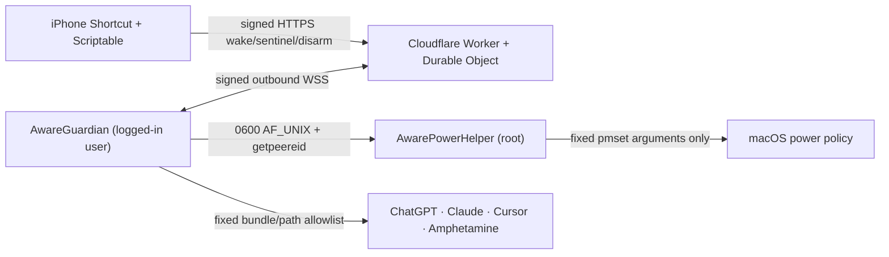

# Aware

Aware lets an authenticated iPhone ask a closed, locked, **already logged-in** MacBook to launch ChatGPT/Codex, Claude/Cowork, Cursor, and Amphetamine. It works without router port forwarding or an always-on relay by keeping a very small guardian process online and preventing full system sleep while Aware is armed.

> [!CAUTION]
> Aware intentionally changes macOS sleep behavior using the undocumented `pmset -a disablesleep 1` setting. An armed Mac can remain awake with its lid closed and can consume its battery. Never leave it in a sleeve, backpack, bed, or other unventilated place. Complete the open-lid acceptance tests below before relying on it remotely. This repository does not claim a 24-hour battery duration until the specific Mac passes calibration.

> [!IMPORTANT]
> Installing Aware starts a root LaunchDaemon and a user LaunchAgent. Once Guardian connects, it arms the helper. Read this guide, deploy the Worker, and keep the Mac open, attended, and ventilated during the first installation. `swift build`, `swift test`, and `swift run AwareCoreChecks` are safe and never call `pmset`; `Resources/scripts/install.sh` is the boundary that installs and activates the services.

## How it works



The phone and Mac have different HMAC keys. The Worker accepts a tiny fixed API, persists operation progress, and relays only `wake`, `return_to_sentinel`, and `disarm`. Guardian owns application and safety policy. The privileged helper accepts only `arm`, `heartbeat`, `disarm`, and `status`; it cannot launch programs or execute caller-provided arguments.

The system never opens inbound Internet ports. Guardian creates the outbound WebSocket, so NAT, changing public IP addresses, and ordinary home routers need no special configuration.

Component references:

- [Native macOS details](Resources/NATIVE.md)
- [Worker deployment and protocol](worker/README.md)
- [iPhone Scriptable and Shortcut setup](shortcut/README.md)

## Safety and security model

- FileVault, SIP, the macOS lock screen, and normal login remain enabled. Aware never stores, types, or bypasses the Mac password.
- The Mac must already have a logged-in GUI session. Launching apps behind the lock screen is not the same as unlocking it.
- The helper socket is owned by the configured GUI UID, mode `0600`, and verifies every peer using `getpeereid(3)`.
- The helper runs only `/usr/bin/pmset -a disablesleep 0` or `1`, with compiled-in arguments. Tests substitute a fake controller.
- Guardian sends a heartbeat every 30 seconds. The helper uses a monotonic clock and sub-second checks to restore normal sleep by its 120-second lease ceiling. Disarm intent stops heartbeats before restoration is attempted; failed restoration is retried without renewing the lease. A helper restart is re-armed only while Guardian still has an armed intent.
- Phone and host requests use role-separated, 32-byte HMAC-SHA256 keys, five-minute timestamp bounds, and atomic nonce replay protection.
- Cloud input can select only `chatgpt`, `claude`, `cursor`, and `amphetamine`, and only 30 minutes, 120 minutes, or `reserve`. It cannot supply shell commands, paths, AppleScript, or bundle identifiers.
- Aware atomically persists the active lease, requested app set, and a collection of every exact owned process identity. New launches append and never overwrite a stubborn survivor of the same app. Cleanup attempts every PID/bundle/start-time identity and retains only exact survivors for later retry; legacy one-per-app state decodes into the collection safely.
- Launch ownership uses a serialized two-phase durable transaction: persist the pre-launch process set and operation/lease, request a distinct instance with `createsNewApplicationInstance`, then own only the completion-returned `NSRunningApplication` when its PID/start identity was not preexisting. Process-list set differences never establish provenance. A crash leaves the pending record unresolved for safe diagnosis and prevents re-arm; Aware never guesses ownership or kills an ambiguous process.
- Desired helper intent is durable. `auto_arm` is consumed only when the state file is first created; every later Guardian restart persists and enforces disarmed intent until a fresh authenticated wake explicitly arms it. Remote disarm and battery/thermal fail-safe paths persist disarmed intent before asking the helper to restore sleep.
- Each application launch has a 15-second hard timeout and captured cancellation generation. Disarm, return-to-sentinel, critical thermal state, and the battery floor invalidate that generation; late completion can never be adopted or restore armed intent.
- Amphetamine is an optional launchable UI app only. Aware never starts or ends an Amphetamine session; the root PowerHelper is the sole authority for `disablesleep`.
- At 25% battery, a 120-minute or reserve lease is refused; a 30-minute lease remains eligible. At 20%, Aware closes its apps and restores normal sleep.
- A serious thermal state refuses launches. A critical thermal state closes Aware-launched apps and restores normal sleep immediately.

## Non-goals and hard limits

Aware does **not**:

- boot a shut-down Mac, recover a depleted battery, cross the FileVault preboot screen, log in after logout/restart, or restore lost Wi-Fi;
- reliably wake a Mac that was allowed to enter full closed-lid battery sleep—the primary design keeps it awake before the lid closes;
- provide screen sharing, mouse/keyboard control, arbitrary remote code execution, SSH, VNC, or a general app launcher;
- make sustained AI workloads last 24 hours on battery or override macOS thermal protection;
- promise availability when Cloudflare, the local network, or an application vendor is unavailable;
- make a closed, awake Mac safe to carry in a bag.

Physical access or restored AC is required after shutdown, logout, restart, battery depletion, full sleep, or loss of the remembered Wi-Fi network.

## Prerequisites

- macOS 14 or newer on a Mac that will remain on a hard, ventilated surface.
- A logged-in GUI account and working Wi-Fi.
- Apple Command Line Tools with Swift 6.
- ChatGPT, Claude, Cursor, and Amphetamine installed in `/Applications` under their standard bundle identifiers.
- Remote access enabled in ChatGPT/Codex and Dispatch enabled in Claude/Cowork before the screen is locked.
- Node.js 20 or newer and a Cloudflare account for the Worker.
- [Scriptable](https://scriptable.app/) on the iPhone.

## Build and test first

These commands compile and test locally; they do not install services or change live power settings:

```zsh
swift build
swift test
swift run AwareCoreChecks

cd worker
npm install
npm test
npm run typecheck
cd ..

node --test shortcut/signing.test.mjs
```

`AwareCoreChecks` is the authoritative framework-independent safety runner on Command Line Tools-only machines. It uses a fake power controller and checks watchdog restoration, the bounded Battery Day, reserve policy, the HMAC test vector, cloud decoding, and a real temporary `0600` Unix socket.

## Manual deployment and installation

### 1. Generate separate phone and host keys

Run this twice and store both outputs in a password manager. Do not reuse one key for both roles.

```zsh
openssl rand -base64 32 | tr '+/' '-_' | tr -d '='
openssl rand -base64 32 | tr '+/' '-_' | tr -d '='
```

Call the first result `PHONE_BASE64URL_SECRET` and the second `HOST_BASE64URL_SECRET`. Each unpadded value should be 43 characters.

### 2. Deploy the Cloudflare Worker

```zsh
cd worker
npm install
npm test
npm run typecheck
npx wrangler login
npx wrangler secret put AWARE_HMAC_KEYS
```

When prompted for `AWARE_HMAC_KEYS`, enter one line with the real values:

```json
{"phone-v1":"PHONE_BASE64URL_SECRET","host-v1":"HOST_BASE64URL_SECRET"}
```

Then deploy:

```zsh
npx wrangler deploy
```

Record the resulting HTTPS URL, for example `https://aware-worker.example.workers.dev`. The Mac socket URL is the same origin with the `wss` scheme and `/v1/host/socket`, for example `wss://aware-worker.example.workers.dev/v1/host/socket`.

Never put production secrets in `worker/wrangler.toml`, source files, URLs, screenshots, or shell history. The `wrangler secret put` prompt avoids adding the Worker key map to the repository.

### 3. Install the Mac services

Keep the Mac **open, attended, on AC, and ventilated**. From the repository root, pass the non-secret Worker URL and host key ID—not the phone key—to the installer. Enter the host secret only at the installer’s masked prompt:

```zsh
sudo Resources/scripts/install.sh 'wss://YOUR-WORKER/v1/host/socket' 'host-v1'
```

The installer:

1. builds release binaries as the logged-in GUI user;
2. installs them under `/usr/local/libexec/aware`;
3. writes the root helper configuration at `/Library/Application Support/Aware/helper.plist` with mode `0600`;
4. writes the user configuration at `~/Library/Application Support/Aware/config.plist` with mode `0600`;
5. reads the masked host secret from the terminal and pipes it directly to the installed `AwareGuardian --setup-keychain` process, which creates the item that the same installed executable later reads (service `com.aware.guardian`, account `host-v1`); the secret is never in argv or the environment. Guardian uses an `LAContext` with `interactionNotAllowed`, so it never assumes a hidden Keychain prompt can be answered—an ACL mismatch fails installation/startup explicitly;
6. bootstraps `com.aware.power-helper` and `com.aware.guardian`.

Confirm that the Keychain item exists without printing its secret:

```zsh
security find-generic-password -s com.aware.guardian -a host-v1
```

Do not use the `-w` flag while diagnosing; it prints the password. Aware does not request Automation permission for Amphetamine because it only launches its UI.

### 4. Configure the phone

Follow [shortcut/README.md](shortcut/README.md): install Scriptable, add `AwareSigning.js`, `AwareRemoteCore.js`, and `AwareRemote.js`, then configure:

- Worker URL: the deployed **HTTPS** base URL;
- key ID: `phone-v1`;
- secret: `PHONE_BASE64URL_SECRET`.

Run **Show host status** before creating home-screen Shortcuts. Then add wake parameters such as:

```json
{"action":"wake","apps":["chatgpt","claude","cursor","amphetamine"],"duration_minutes":120}
```

Create separate Status and **Disarm / Restore Normal Sleep** buttons if useful. Disarm closes only exact app processes launched by Aware, sends `pmset ... disablesleep 0` through the helper, and makes a closed Mac unreachable once it sleeps. It never changes an Amphetamine session.

## Operating states and leases

| State | Meaning |
|---|---|
| `ac_ready` | Aware is armed on AC; sleep is disabled and requested services can remain available. |
| `battery_sentinel` | Sleep is disabled on battery; only Guardian and its outbound connection should remain after the two-minute AC-loss grace period. |
| `battery_active` | Selected applications are running under a 30-minute, 120-minute, or reserve lease. |
| `reserve_sleep` | Battery or thermal safety restored normal sleep and remote availability is ending. |
| `offline` | Guardian is stale/disarmed, or the Mac is asleep, shut down, logged out, depleted, or disconnected. |

- **30 minutes** is the only lease accepted at 25% battery.
- Auto-arm is the current **Arm Battery Day** mode. Its original deadline is persisted atomically and is never extended by Guardian restarts. The deadline is the earliest of 24 hours and the calibrated time to the 20% reserve; without a valid three-run calibration, the mode is explicitly best-effort and must not be called “24-hour ready.” After that deadline and any active timed lease, Aware restores normal sleep. A reserve lease continues to the 20% reserve by explicit request.
- **120 minutes** is the default phone request.
- **Reserve** has no time deadline but still stops at 20% battery or critical thermal state.
- At lease expiry, Aware gracefully closes apps it launched and returns to the armed sentinel behavior.
- Timed leases expire identically on AC and battery. AC does not make a 30- or 120-minute request indefinite.
- **Return to sentinel** closes only exact Aware-owned process instances while keeping the helper armed. It is distinct from **Disarm**, which restores normal macOS sleep.
- **Disarm** is different from lease expiry: it restores normal macOS sleep and sacrifices closed-lid reachability.
- If an active requested app exits unexpectedly, Guardian attempts to relaunch it while the lease remains valid.

Keep the screen locked during normal use. Aware launches applications in the existing GUI session but never unlocks it.

## Calibration and acceptance

Do not label this Mac “24-hour ready” from battery capacity alone. Measure its actual sentinel drain.

### Drain calibration

Run three separate eight-hour trials beginning near full charge:

1. Keep the Mac on a hard, ventilated surface and connected to the target Wi-Fi.
2. Arm Aware, allow the two-minute battery-sentinel transition, lock the screen, and close the lid.
3. Do not start remote applications during the trial.
4. Record starting battery, ending battery, duration, room conditions, and any network interruption.
5. Calculate drain per hour: `(start_percent - end_percent) / hours`.
6. Use the worst of the three valid trials for `sentinel_drain_percent_per_hour` in the user plist.

The 24-hour claim passes only when:

```text
(starting battery percent - 20) / worst drain percent per hour >= 24
```

Without that calibration, host status returns `readiness_estimate_quality: best_effort` and the phone explicitly labels the estimate **best-effort; uncalibrated**. Editing `config.plist` requires restarting the Guardian LaunchAgent and should be done while physically present.

### Acceptance matrix

| Scenario | Trials | Pass condition |
|---|---:|---|
| Closed-lid battery phone wake | 20 | Request acknowledged within 10 seconds; every selected app starts within 30 seconds; Mac remains locked. |
| Unexpected AC loss | 10 | Guardian remains connected, enters sentinel behavior, and gracefully closes Aware-launched apps after two minutes when no active phone lease exists. |
| Guardian stops heartbeating | 3 | Helper restores normal sleep no later than 120 seconds after the last heartbeat. Perform attended with lid open. |
| Helper restart | 3 | Startup first restores normal sleep; Guardian subsequently re-arms. Perform attended with lid open. |
| Lease expiry | 6 | Two trials per duration behavior; only Aware-launched apps close, pre-existing apps remain. |
| Battery reserve | 3 | Long leases refused at 25%; normal sleep restored at 20%. |
| Thermal safety | 3 | Serious refuses new launch; critical restores sleep. Use a controlled software test or injected test fixture—never intentionally overheat hardware. |
| Wi-Fi loss/recovery | 5 | Host becomes offline after the configured stale interval and reconnects without opening inbound ports after Wi-Fi returns, provided the Mac stayed awake. |
| Authentication/replay | 10 | Wrong role/key/signature, stale timestamp, reused nonce, unknown field, and arbitrary app requests are rejected. |
| Disarm and reboot | 3 each | Disarm restores normal sleep; after reboot Aware does not cross FileVault/login and waits for a GUI login. |

Record median and worst readiness, failure reason, battery delta, and macOS version for every trial. Any security-boundary failure, unintended app termination, missed reserve action, or unlocked screen is a release blocker.

## Troubleshooting

Native logs:

```text
~/Library/Logs/AwareGuardian.log
/var/log/aware-power-helper.log
```

Useful read-only checks:

```zsh
launchctl print "gui/$(id -u)/com.aware.guardian"
sudo launchctl print system/com.aware.power-helper
pmset -g custom
security find-generic-password -s com.aware.guardian -a host-v1
```

- **Host is offline:** confirm a GUI user is logged in, Wi-Fi works, the Worker URL uses `wss://.../v1/host/socket`, both launchd jobs are running, and the host key ID is listed in `AWARE_HOST_KIDS`.
- **401/403 authentication:** verify phone and host role IDs were not swapped, the correct base64url secret is installed, and date/time is automatic on both devices.
- **409 replay or stale request:** retry from the phone to generate a new nonce; correct device clock skew if persistent.
- **Helper connection failure:** verify `/var/run/aware/power-helper.sock` exists, is owned by the GUI UID, and is mode `0600`; inspect the helper log before changing permissions.
- **An app does not launch:** confirm its standard app exists directly under `/Applications` and its bundle ID has not changed. Aware intentionally rejects renamed or relocated copies.
- **Amphetamine opens but has no session:** expected. The app is UI-only; PowerHelper alone controls closed-lid sleep prevention.
- **Reserve/thermal rejection:** this is expected safety behavior. Restore AC, let the Mac cool naturally, and do not bypass the threshold.
- **Phone timeout:** inspect the returned host snapshot and query the request again. A timeout does not prove the Worker discarded it.

To remove Aware while physically present:

```zsh
sudo Resources/scripts/uninstall.sh
```

The installer accepts macOS's standard root-owned, group-writable `/private/var/run` parent and creates/validates only the dedicated root-owned `0755` `/private/var/run/aware` child. `Resources/scripts/install.sh --validate-runtime-parent` performs the actual parent-metadata check without root or mutation.

An upgrade reads the current and replacement secrets separately before any destructive action. The old installed Guardian verifies the current secret against its Keychain item using standard input, while both distinct secrets are retained only in root-owned `0600` staging files. The installer then stages verified binaries and rollback backups, stops the jobs, restores normal sleep, and asks the old Guardian to delete its item. Any later failure restores the old binaries/configuration, recreates the old key ID with the verified **old** secret, and restarts the old jobs; the replacement Guardian receives only the **new** secret. `--validate-upgrade-order` and `--validate-secret-routing` check the transaction without system mutation. Uninstall uses the installed Guardian rather than the `security` CLI and removes the operational Battery Day deadline after teardown.

Secrets must be canonical, unpadded base64url values decoding to at least 32 bytes. The staged Guardian validates both prompt files, the old installed Guardian checks the current Keychain item, and the new installed Guardian performs a Keychain readback before either launchd job is bootstrapped or the upgrade commits.

Fresh installation also runs as a transaction. Before any installed artifact or Keychain mutation, cleanup is armed for normal failure, exit, interruption, and termination. It tracks only artifacts created by that attempt, stops exact Aware labels, restores sleep, removes the new Keychain item through Guardian, and removes those artifacts so installation can be retried. `--validate-fresh-rollback` exercises a post-Keychain failure fixture and reinstall.

If Keychain deletion itself fails during rollback, Guardian and root-owned recovery metadata are deliberately preserved. The next installer or uninstaller recognizes that marker, retries deletion through the same installed Guardian identity, and removes the attempt only after deletion succeeds.

Recovery metadata is atomically phase-tracked as `pre_guardian`, `guardian_installed`, or `keychain_attempted` and contains the exact attempt artifact manifest, including temporary `.new` paths. The first two phases prove Keychain setup was not attempted and permit direct cleanup even if a crash left a Guardian file. Only `keychain_attempted` requires the preserved Guardian identity and Keychain deletion before artifact removal.

The initial `pre_guardian` plist is fully written, mode-checked, and plist-validated at the deterministic root-owned `.fresh-recovery.plist.new` path before a same-directory atomic rename publishes it. A crash before rename can leave only that allowlisted temp; the next installer removes it without trusting its contents. A published final marker is therefore always structurally valid.

The uninstall script unloads both jobs, explicitly restores normal sleep, deletes installed binaries/system configuration and the exact Keychain secret, clears operational lease/pending-launch state, and preserves user calibration/configuration. A Keychain permission failure aborts before root owner/key metadata is removed so the deletion can be retried safely. Confirm ordinary lid sleep afterward.

## Experimental paths

- **iMessage dark-wake trigger:** remains hard-disabled. `imessage_adapter_enabled` must be `false`; the shipped Guardian refuses to start otherwise. Do not disable SIP or use message injection. It may be considered only after 19 of 20 closed-lid battery trials succeed with median readiness under two minutes and strict self-chat, timestamp, nonce, and HMAC validation.
- **Find My Play Sound:** can be tried manually as an audible accelerator when the Mac is otherwise eligible to receive it. It is not authenticated through Aware, is not silent, and is not a guaranteed wake mechanism.
- **Low Power Mode:** Aware does not change it. Enable an automated battery policy only after 20 of 20 closed-lid trials preserve the Guardian connection and measured drain is lower.
- **RTC wake and Wake-on-LAN:** intentionally excluded from battery recovery because closed-lid behavior is not reliable enough for this design.

These experiments must never weaken FileVault, SIP, the lock screen, application allowlists, or the helper watchdog.
